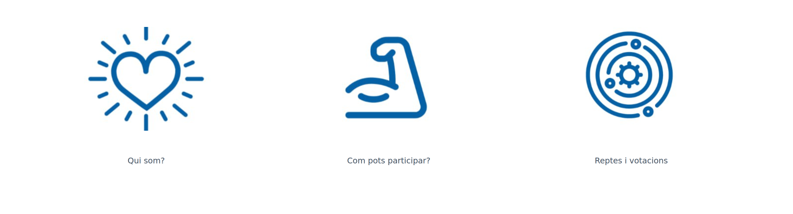

# decidim_colabs

Free Open-Source participatory democracy, citizen participation and open government for cities and organizations

This is the open-source repository for decidim_colabs, based on [Decidim](https://github.com/decidim/decidim).

## Setting up the application

You will need to do some steps before having the app working properly once you have deployed it:

1. Create a System Admin user: `bin/rails decidim_system:create_admin`
1. Visit `<your app url>/system` and login with your system admin credentials
1. Create a new organization. Check the locales you want to use for that organization, and select a default locale.
1. Set the correct default host for the organization, otherwise the app will not work properly. Note that you need to include any subdomain you might be using.
1. Fill the rest of the form and submit it.

You are good to go!


## Customizations

This application has some addons and customizations over the Decidim defaults:

1. A custom block for the home page called "Blocks of links" that allows to to add 3 of links to the home page.
  

2. A syncronization between all the users that log in through an Identity provider (aka. Oauth)2) as members of an assembly.
  To configure this, you need to set the following environment variables:
    - `IDENTITY_SYNC_ASSEMBLY_SLUG` the slug of the assembly you want to sync the users to.
    - `IDENTITY_SYNC_PROVIDER` the name of the oauth2 provider you are using (defaults to `wpoauth`).
    - `IDENTITY_SYNC_POSITION` the position you want to give to the users as a member in the assembly (defaults to `other`).
    - `IDENTITY_SYNC_POSITION_OTHER` the position you want to give to the users as a member in the assembly when the position is `other` (defaults to `Participant`)

## Automatic Translations

The Azure AI translator API is integrated, ENV vars:

- `TRANSLATOR_API_KEY` the API KEY needed to make it work
- `TRANSLATOR_REGION` the region associated with your Azure subscription (defaults to `westeurope`)
- `TRANSLATOR_ENDPOINT` the endpoint for the Azure Translator API (defaults to `https://api.cognitive.microsofttranslator.com`)

Also a rake task is create to allow automatic translation of content already created:

Use with source,target language:

```bash
bin/rails colabs:translate_all[ca,es]
```
